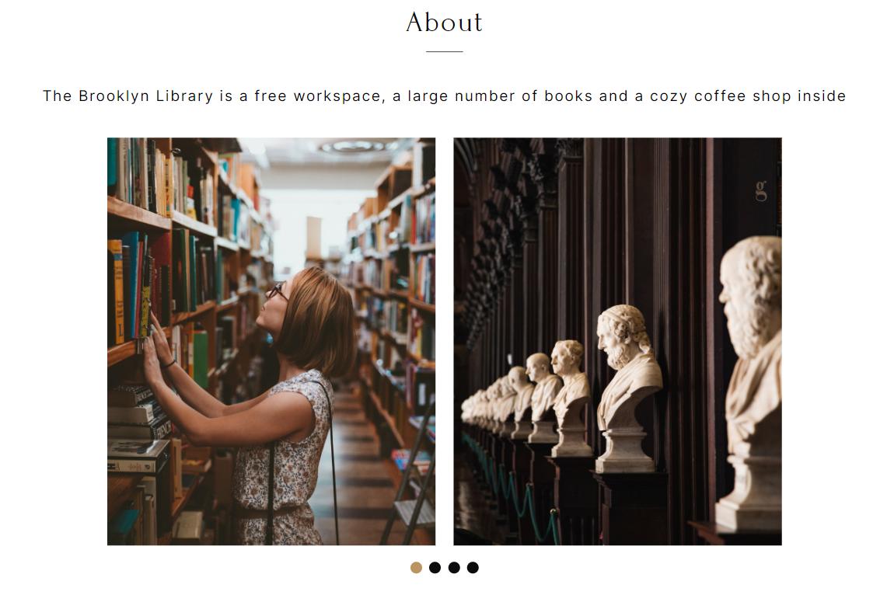

⭐⭐⭐ I present to you a set of super-interesting projects on design and layout practice from the IT school [The Rolling Scopes School](https://rs.school/js-stage0/) ⭐⭐⭐

---
## Library
[>>>TRY IT!👌](https://julietbrn.github.io/js-projects/library/)
### Key skills:
- valid semantic adaptive layout
- easy to maintain readable code
- export styles and graphics from Figma
- using JavaScript to implement the functionality specified in the task

`localStorage` `JS` `adaptive layout` `DOM` `animation` `git`

---
## Memory-game
[>>>PLAY!😁](https://julietbrn.github.io/js-projects/random-game/)

Creating computer games is a separate area of programming that requires highly qualified developers. Computer games can be created by large companies, small teams, and even individual developers.

### Project Description
Memory-game is a set of pairs of identical cards, which are displayed face down. By clicking on a card, the player turns it over and clicks on the next card. If two cards show the same pictures, they remain open; if the pictures are different, the cards are turned face down. The goal of the game is to open all the cards in the least number of moves.

`animation` `design` `localStorage` `git`

---
## Audio-player
[>>>ENJOY IT!👍](https://julietbrn.github.io/js-projects/audio-player/)
### Project Description
A music player that allows you to play music tracks one by one or scroll through them by clicking on the buttons. Each music track has a specific background image.

`audio` `git`

---
## Image-gallery
[>>>TRY IT!💜](https://julietbrn.github.io/js-projects/image-gallery/)
The application that displays photos received from the API. Added search to the application. When you enter a search query, change the photos that are displayed in the application

`API` `Unsplash` `git`

